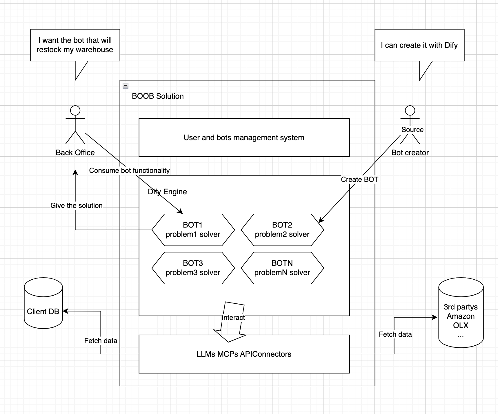

# BOOB - Back Office Operations Bots Solution



> Automate routine back-office operations with intelligent bots

This is a submodule of the main repository: [BOBHack](git@github.com:Fl0p/BOBHack.git)

## About

Created during **synder-hackathon-wroclaw-2025** hackathon, this project provides a comprehensive platform for creating and managing intelligent bots to automate back-office operations.

## Team

- [Fl0p](https://github.com/Fl0p)
- [itbeard](https://github.com/itbeard)
- [gamezovladislav](https://github.com/gamezovladislav)

## Demo

Check out the live demo: [https://bob.aignite.pl/](https://bob.aignite.pl/)

## Features

- Intelligent bot creation and management
- Automated back-office operations
- Auto-fill forms functionality
- AI-powered workflow automation
- Plug-and-play support for any LLM
- Integration with multiple systems
- Google OAuth2 authentication
- Easy-to-use interface

## Back-Office Bot Platform: Processes We Unlock

> This isn’t a one-off bot for a single form. We built the **core of a back-office bot platform** that handles product cards, returns, expenses, supplier requests, and any other operational form with equal confidence.

Every back-office process is captured as a configuration: fields, types, mandatory logic, validation rules, data sources. On top sits a unified LLM layer that pulls data from integrations, assembles a structured answer, and returns a ready draft to the operator. The product-card bot is showcased as the **first module** on this platform, not the only use case.

### Why the Platform Beats “Just One Bot”

1. **Unified form model.** Any form lives in a single format: fields → type → required → validation rules → AI hints. The core doesn’t care whether it is a product form or a return — just different configurations.
2. **Reusable AI stack.** One LLM layer handles prompting, structured JSON output, validation, logging. To launch a new bot you describe the form, connect data sources, and lightly tailor the prompt.
3. **Process scalability.** Today we demo product onboarding. Tomorrow returns, supplier requests, expenses. The architecture already lets us “stamp” bots via configuration instead of rewriting projects.
4. **Single operator workspace.** All back-office bots live in one interface: today the operator onboards products, tomorrow files a return, next week prepares an expense report — without system hopping.
5. **Bridge operators and makers.** The platform gives non-technical back-office teams a clear way to describe fields, rules, and data sources, while technical specialists reuse the same core to spin up the bot — collaboration happens in one place instead of endless briefs.

### How It Lands in the Business Story

> For the business this is a **platform play**: integrate with data once, sign off security and access once, then spin up new processes without heavy rollouts. Each incremental use case gets cheaper and the roadmap stays predictable.

**The foundation already runs.** During the hackathon we shipped the platform core for product onboarding: forms are configuration-driven, the backend is field-agnostic, the LLM layer is universal. New bots land on the same foundation without rewriting the system.

> Our “form filler” isn’t a script for one scenario but the **first brick of an ecosystem of back-office bots** that strip routine from the entire operational cycle.

## Technology Stack

**AI Engine:** [Dify.ai](https://dify.ai/) - Production-ready AI Agent platform for building agentic workflows, RAG pipelines, and intelligent automation.

- **Backend:** Node.js + Express + TypeScript
- **Frontend:** React + Vite + TypeScript
- **Browser Extension:** JavaScript
- **Database:** PostgreSQL
- **Package Manager:** Yarn 4.10.3 with workspaces
- **Networking:** Cloudflare Tunnel
- **Containerization:** Docker (all services in a single YAML)
- **CI/CD:** Automated deployment pipeline

## Quick Start

### Using Docker Compose (Recommended)

```bash
# Clone repository
git clone git@github.com:Fl0p/BOBHack.git
cd BOBHack

# Configure environment
cp .env.example .env
nano .env  # Add your configuration

# Start all services
docker-compose up -d

# Check status
docker-compose ps

# View logs
docker-compose logs -f
```

All services will be available:
- Frontend: `https://bob.aignite.pl`
- Backend: `https://api.aignite.pl`
- Dify Platform: `https://dify.aignite.pl`

### Local Development

```bash
# Install Yarn 4.10.3
corepack enable
corepack prepare yarn@4.10.3 --activate

# Install dependencies
yarn install

# Run both backend and frontend
yarn dev

# Or run separately
yarn dev:backend  # Backend on http://localhost:3001
yarn dev:frontend # Frontend on http://localhost:3000
```

## Documentation

📚 Comprehensive documentation is available in the [`docs/`](./docs/) directory:

- [Setup Guide](./docs/setup.md) - Initial setup and configuration
- [Docker Setup](./docs/docker-setup.md) - Docker deployment guide
- [Architecture Overview](./docs/architecture/overview.md) - System architecture
- [Backend Documentation](./docs/backend/README.md) - Backend API and development
- [Frontend Documentation](./docs/frontend/README.md) - Frontend development guide
- [Browser Extension](./docs/extension/README.md) - Extension development
- [OAuth Setup](./docs/oauth_setup.md) - Google OAuth2 configuration
- [Database Access](./docs/database-access.md) - Database management
- [CI/CD Pipeline](./docs/ci-cd.md) - Deployment automation

---

*Built with ❤️💀🤖 during synder-hackathon-wroclaw-2025*
